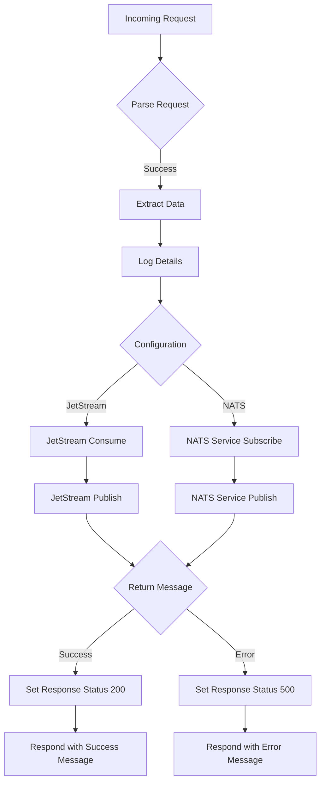

<!-- SPDX-License-Identifier: Apache-2.0 -->

# nats-utilities
Small Utilities Application for NATS Testing

# nats-utilities
 
This application is an HTTP wrapper around Tazama's NATS implementation. At a very high level, this means you can send NATS messages to Tazama processors by sending an HTTP request to this service.
 

 
The application has two endpoints. One for NATS, and another for REST.
 
## Endpoints
 
`/` - Accessible with a `GET` method.
        - Provides a health check
`/health` - Accessible with a `GET` method.
        - Provides a health check
 
### NATS
Available on the path `natsPublish`
Unless if working with the TMS-API (this processor expects an HTTP request), this is the endpoint you would use in your requests.
 
 
### REST
Available on the path `restPublish`.
 
Supported method: `POST`
Message body:
 
```json
{
    "transaction": {},
    "endpoint": "",
    "natsConsumer": "",
    "functionName": ""
}
```
 
When targeting the TMS-API, you would want to use this endpoint.

